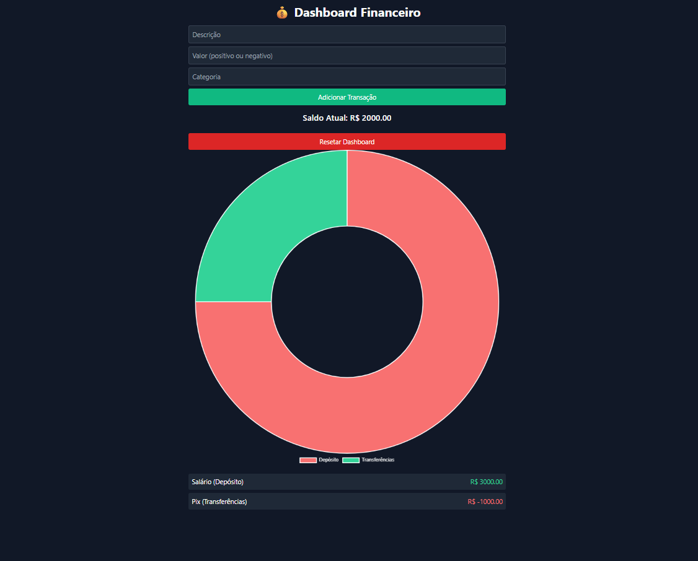

# Dashboard Financeiro

Projeto pessoal criado para praticar HTML, TailwindCSS e JavaScript manipulando dados no navegador.

## Funcionalidades

- Adicionar entradas e saídas financeiras
- Categorização de transações
- Cálculo automático do saldo atual
- Gráfico dinâmico por categoria (doughnut)
- Armazenamento local via `localStorage`
- **Botão de reset** para limpar todas as transações

## Tecnologias utilizadas

- HTML5
- Tailwind CSS
- JavaScript Vanilla
- Chart.js
- Git & GitHub Pages

## Preview

## Como rodar

- Abra o index.html no navegador
- Ou entrar pelo link https://gumoro.github.io/Dashboard-Financeiro/
